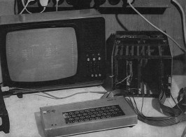

SAPI 1 emulator using FabGL
===========================

The great FabGL library created by Fabrizio Di Vittorio delivers above all graphics library for ESP32 in conjunction with a VGA monitor. In addition to its own library, on the basis of which you can build your own project, it also contains a number of examples for library usage. Among them are emulators of old 8-bit computers from the era about 40 years ago. E.g. here you will find computers Altair 8800, Commodore VIC-20 and even a 16-bit IBM XT computer with a number of optional operating systems.

In the 1980s, the demand for microcomputer control systems increased. For simpler tasks in the industrial and agricultural sector in Czechoslovakia, Mr. Smutny and his team developed the modular microcomputer system SAPI 1. Basic information about it can be found, for example, at https://en.wikipedia.org/wiki/SAPI-1 . The FabGL library makes it relatively easy to create an emulator of such a computer on a VGA screen, so an electrical engineer can reminisce.

SAPI 1 emulator requirements
----------------------------

*   On the HW side, the ESP32 WROVER module must be connected according to the diagram on the website http://www.fabglib.org . It is necessary to connect a VGA monitor and PS2 keyboard to the module. If the MCP23S17 expander circuit is also available, expanding PIO 8255 is partially emulated also.
*   Install the Arduino IDE (tested with version 1.8.13 up to 1.8.19) with ESP32 support. The Arduino IDE must be supplemented with the FabGL library.
*   Place the folder that contains the three files DirectSAPI1.ino, MHB2501font.h and JPR1rom.h in the folder where Arduino saves projects on your computer.
*   After opening the project, you should be able to load the program into the ESP32 memory (instructions are on the website). The settings are the same as for the other computers in the examples FabGL shown in video tutorials.
*   A microSD card is not required for the function.

The principle of the emulator program
-------------------------------------

The program mainly uses FabGL library classes for work. The graphical interface of the application is made up of the drawScanline function, which prepares individual points for display on a VGA monitor. Key presses on the connected PS2 keyboard are handled in the processKeyDown and processKeyUp functions. The actual emulation of the 8080 processor is done by an instance of the i8080 class.

The second library used in the program is SPIFFS. This serves to create a "cassette tape recorder". Programs that would be stored on cassette are stored in ESP32 memory within SPIFFS as xxxx.bas files, where "xxxx" specifies the name entered in the "SAVE" or "LOAD" command.

Using an emulator
-----------------

The program can be controlled via a connected PS2 keyboard. The Esc key resets the processor and the entire computer. The F1 and F2 keys correspond to the INT and T keys on the original ANK-1 keyboard. There are then 40 active keys on the keyboard, which correspond to the keys of the ANK-1 membrane keyboard (note: Ctrl corresponds to "LF" on the ANK-1). It is necessary to search for the instruction manual of the microcomputer on the web.

The program can be saved (or loaded) with the command "SAVE" (or "LOAD"). After that, the user is prompted to enter a file name with a maximum length of 8 characters. The extension ".BAS" is added automatically. The command takes a while to process because control is passed to BASIC. Stored data (files on "cassette tape") remain in ESP32 memory until you overwrite them.

If the ESP32 has an MCP23S17 expander connected, you can use it in the BASIC program as two input/output ports. The address of port A is 6, for port B it is 8. The switching of the direction of individual bits is done by a mask at address 7 for port A and 9 for port B.

Conclusion
----------

In the FabGL library users gained a powerful tool for creating not only their own projects, but in the examples of emulated computers also a lot of older software created for completely different devices many years ago.

References
----------

http://www.fabglib.org  
https://github.com/fdivitto/FabGL  

* * *

Emulátor SAPI 1 pomocí FabGL
============================

Skvělá FabGL knihovna, kterou vytvořil Fabrizio Di Vittorio, přináší především grafickou knihovnu pro ESP32 ve spojení s VGA monitorem. Kromě vlastní knihovny, na jejímž základě můžete postavit vlastní projekt, obsahuje i řadu příkladů pro použití knihovny. Mezi nimi jsou i emulátory starých 8bitových počítačů z doby před asi 40 lety. Např. zde najdete počítače Altair 8800, Commodore VIC-20 a dokonce i 16bitový počítač IBM XT s řadou volitelných operačních systémů.

V 80-tých letech se rozvinula poptávka po mikropočítačových řídicích systémech. Pro jednodušší úkoly v průmyslovém a zemědělském sektoru v Československu vyvinul ing. Smutný s kolektivem modulární mikropočítačový systém SAPI 1. Základní informace o něm najdete např. na https://en.wikipedia.org/wiki/SAPI-1 . Knihovna FabGL umožňuje poměrně snadno vytvořit emulátor takového počítače na VGA obrazovce, takže případný zájemce může zavzpomínat.

Požadavky pro emulátor SAPI 1
-----------------------------

*   Po HW stránce musí být modul ESP32 WROVER zapojený podle schéma na stránkách http://www.fabglib.org . K modulu je potřeba připojit VGA monitor a PS2 klávesnici. Pokud je k dispozici i obvod expanderu MCP23S17, lze jej využít jako 2 nezávislé osmibitové vstup/výstupní porty pro ovládání připojeného zařízení.
*   Na osobním počítači musí být instalováno Arduino IDE (testováno s verzí 1.8.13 až 1.8.19) s podporou ESP32. Arduino IDE se doplní o knihovnu FabGL.
*   Složku, která obsahuje tři soubory DirectSAPI1.ino, MHB2501font.h a JPR1rom.h umístěte do složky, kam Arduino ukládá na vašem počítači projekty.
*   Po otevření projektu byste měli být schopni nahrát program do paměti ESP32 (návody jsou na webu). Nastavení je stejné jako u dalších počítačů v příkladech FabGL ukázaných ve video návodech.
*   Pro funkci není potřeba mikroSD karta.

Princip programu emulátoru
--------------------------

Program využívá pro práci především třídy knihovny FabGL. Grafické rozhraní aplikace je tvořeno funkcí drawScanline, která připravuje jednotlivé body pro zobrazení na VGA monitoru. Zmáčknutí klávesy na připojené klávesnici PS2 je zpracováno ve funkcích procesKeyDown a procesKeyUp. Vlastní emulaci procesoru 8080 provádí instance třídy i8080.

Druhou knihovnou použitou v programu je SPIFFS. Ta slouží k vytvoření "kazetového magnetofonu". Programy, které by se ukládaly na kazetu, jsou v rámci SPIFFS ukládány do paměti ESP32 jako soubory xxxx.bas, kde "xxxx" určuje jméno zadávané v příkazu "SAVE" nebo "LOAD".

Použití emulátoru
-----------------

Program je možné ovládat přes připojenou klávesnici PS2. Klávesa Esc vyvolá reset procesoru a celého počítače. Klávesy F1 a F2 odpovídají tlačítkům INT a T na původní klávesnici ANK-1. Na klávesnici je pak aktivních 40 kláves, které odpovídají klávesám membránové klávesnice ANK-1 (pozn.: Ctrl odpovídá "LF" na ANK-1). Návod k použití mikropočítače je nutné hledat na webu.

Program je možné uložit (nebo nahrát) příkazem "SAVE" (nebo "LOAD"). Po něm je uživatel vyzván, ať vloží jméno souboru o délce max. 8 znaků. Přípona ".BAS" se doplňuje automaticky. Zpracování příkazu chvíli trvá, protože je řízení předáno do BASICu. Uložená data (soubory na "pásce kazetového magnetofonu") zůstávají v paměti ESP32 do doby, než je přepíšete.

Má-li ESP32 připojený expander MCP23S17, můžete jej využívat v programu BASIC jako dvě vstup/výstupní brány. Adresa portu A je 6, u portu B je to 8. Přepínání směru jednotlivých bitů se prování maskou na adrese 7 pro port A a 9 pro port B.

Závěr
-----

V knihovně FabGL získali její uživatelé mocný nástroj na tvorbu nejen vlastních projektů, ale jak ukazují příklady emulovaných počítačů i na využití staršího software vytvořeného pro úplně jiná zařízení před mnoha lety.

Použitá literatura
------------------

http://www.fabglib.org  
https://github.com/fdivitto/FabGL